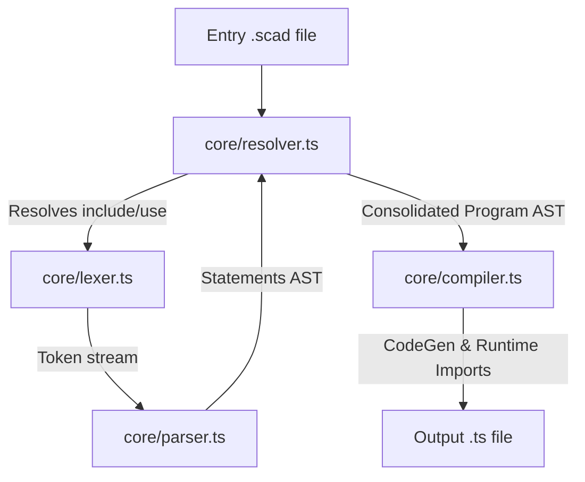

# OpenSCAD to Manifold.js Prototype Compiler


## Setup and Running Locally

To get the OpenSCAD compiler running on your local machine, follow these steps:

### 1. Install Dependencies
Ensure you have Node.js installed, then install the package dependencies:
```bash
npm install
```

### 2. Configure Libraries Search Path (Optional)
If you want to use external libraries (such as BOSL2), configure the `OPENSCADPATH` environment variable in your terminal:
- **PowerShell**:
  ```powershell
  $env:OPENSCADPATH = "C:\Users\<you>\Documents\OpenSCAD\libraries"
  ```
- **Bash**:
  ```bash
  export OPENSCADPATH="$HOME/Documents/OpenSCAD/libraries"
  ```

### 3. Build the CLI Tool
Build the compiler script into its final CommonJS bundle:
```bash
npm run build
```

## Available Commands

The CLI is built using `commander`. It exposes two main commands:

### 1. `compile`
Compiles a single OpenSCAD source file to an executable TypeScript file.

```bash
# General syntax
npx tsx index.ts compile <input-file> [--output <output-file>]

# Example (default output is test/out/cube.ts)
npx tsx index.ts compile test/examples/cube.scad

# Example with custom output
npx tsx index.ts compile test/examples/cube.scad --output test/out/custom_cube.ts
```

- **Arguments**:
  - `<input>`: The path to the source `.scad` file to compile.
- **Options**:
  - `--output <path>`: The output `.ts` file path. **Note:** The target file must end with the `.ts` extension. If omitted, the output defaults to `test/out/<input-filename>.ts`.

### 2. `compile-all`
Discovers and compiles all `.scad` files in the `test/examples/` folder.

```bash
npx tsx index.ts compile-all
```
---

## Architecture & Compilation Flow

The compiler acts as a translator converting OpenSCAD declarative models into executable TypeScript files that leverage the `manifold-3d` mesh libraries.

The compilation process flows through the following phases:


---

## Viewer

Start any static file server from project root, for example:

```bash
npx serve .
```

Then open:
- http://localhost:3000/viewer.html

In the viewer:
- Enter a compiled output file path such as `test/out/cube.ts`
- Click **Load**

---


## Project Layout

- [core/](file:///d:/manifold/bindings/wasm/openscad-compiler/core): The compiler core directory.
  - [ast.ts](file:///d:/manifold/bindings/wasm/openscad-compiler/core/ast.ts): Syntax Tree node definitions.
  - [lexer.ts](file:///d:/manifold/bindings/wasm/openscad-compiler/core/lexer.ts): Tokenizer for OpenSCAD source.
  - [parser.ts](file:///d:/manifold/bindings/wasm/openscad-compiler/core/parser.ts): OpenSCAD parser building the AST.
  - [resolver.ts](file:///d:/manifold/bindings/wasm/openscad-compiler/core/resolver.ts): Resolves include/use paths and builds consolidated statements.
  - [compiler.ts](file:///d:/manifold/bindings/wasm/openscad-compiler/core/compiler.ts): Generates TypeScript output from the AST.
  - [ir.ts](file:///d:/manifold/bindings/wasm/openscad-compiler/core/ir.ts): Intermediate representation node definitions.
- [commands/](file:///d:/manifold/bindings/wasm/openscad-compiler/commands): Commander CLI command definitions.
  - [compile.ts](file:///d:/manifold/bindings/wasm/openscad-compiler/commands/compile.ts): Single file compile command.
  - [compile_all.ts](file:///d:/manifold/bindings/wasm/openscad-compiler/commands/compile_all.ts): Bulk compile command.
- [test/](file:///d:/manifold/bindings/wasm/openscad-compiler/test): Test materials and compiler outputs.
  - [examples/](file:///d:/manifold/bindings/wasm/openscad-compiler/test/examples): OpenSCAD sample files.
  - [out/](file:///d:/manifold/bindings/wasm/openscad-compiler/test/out): Destination folder for compiled TypeScript mesh scripts.
- [index.ts](file:///d:/manifold/bindings/wasm/openscad-compiler/index.ts): Main CLI entry point.
- [runtime.ts](file:///d:/manifold/bindings/wasm/openscad-compiler/runtime/runtime.ts) & [runtime.js](file:///d:/manifold/bindings/wasm/openscad-compiler/runtime/runtime.js): OpenSCAD-to-Manifold bridge runtime.
- [tsconfig.json](file:///d:/manifold/bindings/wasm/openscad-compiler/tsconfig.json): TypeScript configuration.
- [package.json](file:///d:/manifold/bindings/wasm/openscad-compiler/package.json): Package manifest and build scripts.
- [viewer.html](file:///d:/manifold/bindings/wasm/openscad-compiler/viewer.html): 3D Three.js mesh visualizer.
- [comparison.md](file:///d:/manifold/bindings/wasm/openscad-compiler/comparison.md): Feature comparison report.
