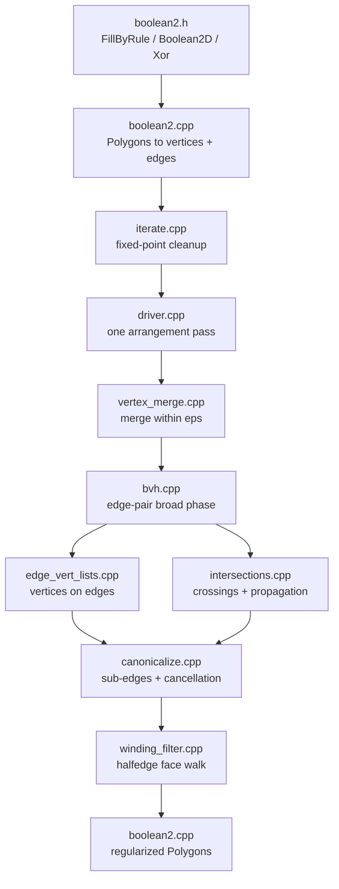

# Boolean2 CrossSection Core

Status: experimental core library for a future `CrossSection` backend. The
default backend remains `clipper2`; this branch only adds the Boolean2 library
and a staged, empty-returning `boolean2` backend translation unit. A later PR
wires that translation unit into the public `CrossSection` methods.

Boolean2 is a manifold-native 2D arrangement pipeline for polygon fill,
Boolean, and XOR operations. Sibling utilities in
`src/cross_section/boolean2/` provide the decomposition and offset pieces that
the follow-up backend wiring uses to cover the rest of the public
`CrossSection` API. The current branch keeps the implementation reviewable by
landing the core library before that public backend wiring is enabled.

## Goals

- Keep Clipper2 available while the new backend bakes upstream.
- Reuse manifold's geometric primitives where practical:
  BVH/sweep broad phase queries, `DisjointSets` for vertex equality, and
  symbolic predicates from `shared.h`.
- Keep the core independent from Clipper2 so the follow-up backend can compile
  either implementation from the same public API surface.
- Make robustness testable through deterministic regression tests and later
  FuzzTest targets that exercise the public `CrossSection` API and
  `CrossSection`/`Manifold` round trips.

## Build Selection

This core can be built behind the experimental backend selector:

```sh
cmake -S . -B build/clipper \
  -DMANIFOLD_CROSS_SECTION=ON \
  -DMANIFOLD_CROSS_SECTION_BACKEND=clipper2

cmake -S . -B build/boolean2 \
  -DMANIFOLD_CROSS_SECTION=ON \
  -DMANIFOLD_CROSS_SECTION_BACKEND=boolean2
```

`clipper2` is the default. Invalid backend names fail at configure time when
`MANIFOLD_CROSS_SECTION` is enabled. In this branch, selecting `boolean2`
builds the core library and an empty-returning placeholder backend, but usable
public `CrossSection` dispatch still lands in the follow-up backend-wiring PR.

## Algorithm Outline

Boolean2 builds a planar arrangement and filters it by per-face winding:

1. Merge vertices within the operation tolerance.
2. Collapse edges whose endpoints merge together.
3. Collect overlapping edge pairs with a sweep/BVH broad phase.
4. Build per-edge lists of vertices that lie on each edge, optionally fused
   with the intersection narrow phase for large parallel cases.
5. Insert edge-edge intersections using the shared symbolic predicates.
6. Structurally re-merge duplicate intersection vertices that share an incident
   edge and are within tolerance.
7. Canonicalize sub-edges and cancel opposing multiplicities.
8. Traverse DCEL faces, propagate winding numbers, and retain boundary edges
   whose adjacent faces disagree under the requested rule.

The high-level fill/Boolean/XOR core API is in
`src/cross_section/boolean2/boolean2.h`. The lower-level driver returns
retained directed sub-edges plus the merged vertex map, and the wrapper turns
those edges back into regularized `manifold::Polygons`. Offset and containment
helpers live in `offset.h` and `containment.h`; they are included by the
follow-up backend wiring rather than by `boolean2.h`.

## Architecture



Shared leaf utilities live in `predicates.*`, and debug/performance tracing
lives in `diagnostics.h`. `offset.*` and `containment.*` are sibling helpers
used by the later backend-wiring PR for the rest of the `CrossSection` API.

## Relationship To The Sketch

This implementation follows the six-step 2D overlap-removal sketch from
upstream issue #289: tolerance-based vertex merge, collapsed-edge removal,
ordered edge vertex lists, snapped edge-edge intersections, multiplicity-based
sub-edge canonicalization, and positive-winding output. The current code
generalizes the final filter so the same arrangement can serve union,
subtract, intersect, XOR, and construction-time fill rules.

The main implementation differences are:

- Vertex merging uses deterministic union-find over all pairs within
  tolerance, then places each cluster at its centroid. The sketch called out
  weighted, up-to-date positions for chains of nearby vertices; the bounded
  fixed-point cleanup below is the mechanism that keeps any residual movement
  from leaking into stale output topology.
- Broad phases use the local boolean2 sweep/BVH helpers. This keeps the core
  independent from the 3D `Collider` surface while preserving the intended
  sub-quadratic candidate search.
- Intersections are discovered from broad-phase edge pairs rather than a
  Bentley-Ottmann sweep. Endpoint-on-edge and collinear degeneracies are
  handled by the edge vertex lists; isolated crossings are inserted or snapped
  to neighboring list vertices.
- Output filtering uses a DCEL face traversal and winding propagation instead
  of independent midpoint ray casts for every sub-edge. This makes one winding
  decision per face, avoids per-edge disagreement around high-valence
  intersection vertices, and still retains exactly the edges whose adjacent
  faces differ under the selected rule.

## Winding Rules

The DCEL filter keeps an edge iff the face on one side is inside the result and
the face on the other side is outside. The built-in predicates are:

- `Add`: `w > 0`, used for union/fill under the default positive-winding rule.
- `Subtract`: implemented by appending the second input with negative
  multiplicity, then using `Add`.
- `Intersect`: `w > 1`, keeping faces covered by both inputs.
- `EvenOdd`: `w & 1`, used by the Boolean2 core XOR helper and available for
  construction-time fill.
- `NonZero`: `w != 0`, available for construction-time fill and offset cleanup.
- `Negative`: `w < 0`, available for construction-time fill and negative-offset
  fallback.

Construction-time fill rules are exposed through `FillByRule`. The public
`CrossSection` backend mapping from `FillRule`, `OpType`, decomposition, and
offset is staged in the backend-wiring branch.

## Regularization And Tolerance

The core operates on `manifold::Polygons`, which cannot encode isolated
one-dimensional features. Output is therefore regularized: zero-area loops,
collapsed edges, and cancelled opposing sub-edges are dropped.

Callers may pass an explicit tolerance. A non-positive tolerance asks the core
to infer an operation scale and apply the local floating-point budget used by
the Boolean2 predicates. Inputs are translated into a local frame before the
arrangement is built, then translated back on output.

The core runs the arrangement to a fixed point with a bounded cleanup pass. If
floating-point residuals keep moving within a small cycle, the fixed-point
helper returns a deterministic representative while preserving the composed
input-to-output vertex remap.

## Validation

Useful local checks:

```sh
cmake -S . -B build/boolean2-core \
  -DMANIFOLD_CROSS_SECTION=ON \
  -DMANIFOLD_CROSS_SECTION_BACKEND=boolean2
cmake --build build/boolean2-core -j4 --target manifold

cmake -S . -B build/clipper-test \
  -DMANIFOLD_CROSS_SECTION=ON \
  -DMANIFOLD_CROSS_SECTION_BACKEND=clipper2 \
  -DMANIFOLD_TEST=ON
cmake --build build/clipper-test -j4 --target manifold_test
ctest --test-dir build/clipper-test -R '^CrossSection\\.' --output-on-failure
```

The `CrossSection` regression command above intentionally targets `clipper2` in
this branch. `MANIFOLD_CROSS_SECTION_BACKEND=boolean2` only builds the core and
empty placeholder backend until the follow-up backend-wiring PR.

Focused backend regression tests, FuzzTest targets, and corpus tooling are
staged in later branches so this core-library branch stays reviewable.
